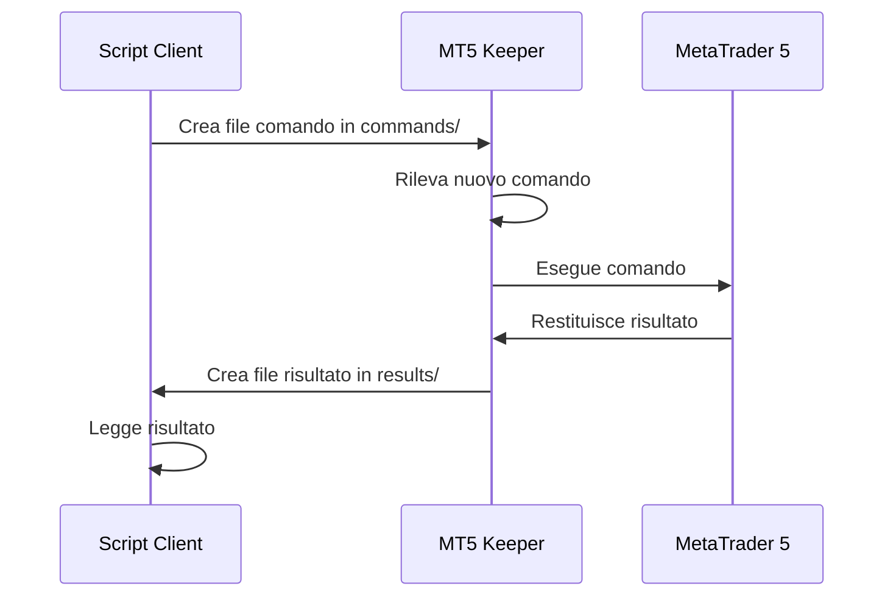
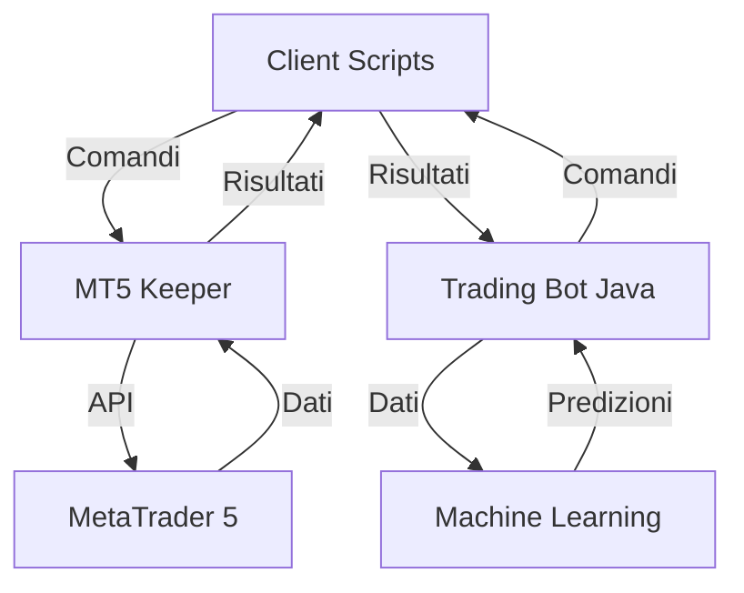

# Riferimento API Python per MT5 Trading Bot

Questo documento fornisce una reference completa per gli script Python utilizzati nel MT5 Trading Bot.

## Indice

- [MT5 Keeper](#mt5-keeper)
- [MT5 Command Base](#mt5-command-base)
- [Comandi di Trading](#comandi-di-trading)
  - [Get Account Info](#get-account-info)
  - [Market Buy](#market-buy)
  - [Market Sell](#market-sell)
  - [Modify Position](#modify-position)
  - [Close Position](#close-position)
  - [Close All Positions](#close-all-positions)
  - [Get Positions](#get-positions)
- [Comandi di Analisi](#comandi-di-analisi)
  - [Get Market Data](#get-market-data)
  - [Get Indicator Data](#get-indicator-data)
  - [Calculate Volatility](#calculate-volatility)
  - [Check Spread](#check-spread)
- [Machine Learning](#machine-learning)
  - [Train Model](#train-model)
  - [Predict Direction](#predict-direction)

## MT5 Keeper

Il MT5 Keeper è un processo singleton che gestisce la connessione persistente a MetaTrader 5.

### Funzionalità Principali

- Inizializzazione unica della connessione MT5
- Directory di lavoro cross-platform (~/.mt5bot/)
- Meccanismo file lock per verifica istanza singola
- Processing file comandi in directory commands/
- Output risultati in directory results/
- Heartbeat per mantenimento sessione
- Riconnessione automatica in caso di disconnessione

### Utilizzo

```python
# Avvio del MT5 Keeper
python mt5_keeper.py
```

### Parametri di Configurazione

| Parametro | Descrizione | Default |
|-----------|-------------|---------|
| `--work-dir` | Directory di lavoro | `~/.mt5bot` |
| `--commands-dir` | Directory dei comandi | `{work-dir}/commands` |
| `--results-dir` | Directory dei risultati | `{work-dir}/results` |
| `--log-level` | Livello di logging | `INFO` |
| `--heartbeat-interval` | Intervallo di heartbeat in secondi | `5` |
| `--reconnect-attempts` | Numero di tentativi di riconnessione | `3` |
| `--reconnect-delay` | Ritardo tra i tentativi di riconnessione in secondi | `5` |

### Esempio di Output

```json
{
  "status": "running",
  "uptime": 3600,
  "connected": true,
  "commands_processed": 120,
  "last_heartbeat": "2025-02-27T15:30:00"
}
```

## MT5 Command Base

La classe base per tutti gli script client che comunicano con il MT5 Keeper.

### Funzionalità Principali

- Verifica esistenza keeper
- Gestione timeout e errori
- Parsing argomenti command-line
- Protocollo comunicazione file-based

### Utilizzo

```python
from mt5_command_base import MT5Command

class MyCommand(MT5Command):
    def __init__(self):
        super().__init__("my_command")
    
    def execute(self, args):
        # Implementazione del comando
        return {"success": True, "result": "Command executed"}

if __name__ == "__main__":
    cmd = MyCommand()
    cmd.run()
```

### Metodi Principali

| Metodo | Descrizione |
|--------|-------------|
| `__init__(command_name)` | Inizializza il comando con il nome specificato |
| `run()` | Esegue il comando, gestendo il parsing degli argomenti e la comunicazione con il keeper |
| `execute(args)` | Metodo astratto da implementare nelle classi derivate |
| `check_keeper_running()` | Verifica se il keeper è in esecuzione |
| `send_command(command_data)` | Invia un comando al keeper |
| `wait_for_result(command_id, timeout)` | Attende il risultato di un comando |

### Parametri di Configurazione

| Parametro | Descrizione | Default |
|-----------|-------------|---------|
| `--work-dir` | Directory di lavoro | `~/.mt5bot` |
| `--timeout` | Timeout in secondi | `30` |
| `--log-level` | Livello di logging | `INFO` |

## Comandi di Trading

### Get Account Info

Ottiene le informazioni sull'account di trading.

#### Utilizzo

```bash
python get_account_info.py
```

#### Output

```json
{
  "success": true,
  "balance": 10000.0,
  "equity": 10050.0,
  "margin": 100.0,
  "free_margin": 9950.0,
  "margin_level": 10050.0,
  "leverage": 100,
  "currency": "USD"
}
```

### Market Buy

Apre una posizione di acquisto al prezzo di mercato.

#### Utilizzo

```bash
python market_buy.py --symbol EURUSD --volume 0.1 --sl 1.1200 --tp 1.1300 --comment "Buy order" --magic 12345
```

#### Parametri

| Parametro | Descrizione | Obbligatorio |
|-----------|-------------|--------------|
| `--symbol` | Simbolo da tradare | Sì |
| `--volume` | Volume in lotti | Sì |
| `--sl` | Livello di stop loss | No |
| `--tp` | Livello di take profit | No |
| `--comment` | Commento dell'ordine | No |
| `--magic` | Magic number | No |

#### Output

```json
{
  "success": true,
  "ticket": 12345678,
  "symbol": "EURUSD",
  "volume": 0.1,
  "open_price": 1.1250,
  "open_time": "2025-02-27T15:30:00",
  "sl": 1.1200,
  "tp": 1.1300,
  "comment": "Buy order",
  "magic": 12345
}
```

### Market Sell

Apre una posizione di vendita al prezzo di mercato.

#### Utilizzo

```bash
python market_sell.py --symbol EURUSD --volume 0.1 --sl 1.1300 --tp 1.1200 --comment "Sell order" --magic 12345
```

#### Parametri

| Parametro | Descrizione | Obbligatorio |
|-----------|-------------|--------------|
| `--symbol` | Simbolo da tradare | Sì |
| `--volume` | Volume in lotti | Sì |
| `--sl` | Livello di stop loss | No |
| `--tp` | Livello di take profit | No |
| `--comment` | Commento dell'ordine | No |
| `--magic` | Magic number | No |

#### Output

```json
{
  "success": true,
  "ticket": 12345679,
  "symbol": "EURUSD",
  "volume": 0.1,
  "open_price": 1.1250,
  "open_time": "2025-02-27T15:30:00",
  "sl": 1.1300,
  "tp": 1.1200,
  "comment": "Sell order",
  "magic": 12345
}
```

### Modify Position

Modifica una posizione esistente.

#### Utilizzo

```bash
python modify_position.py --ticket 12345678 --sl 1.1210 --tp 1.1290
```

#### Parametri

| Parametro | Descrizione | Obbligatorio |
|-----------|-------------|--------------|
| `--ticket` | Ticket della posizione | Sì |
| `--sl` | Nuovo livello di stop loss | No |
| `--tp` | Nuovo livello di take profit | No |

#### Output

```json
{
  "success": true,
  "ticket": 12345678,
  "sl": 1.1210,
  "tp": 1.1290
}
```

### Close Position

Chiude una posizione esistente.

#### Utilizzo

```bash
python close_position.py --ticket 12345678 --volume 0.1
```

#### Parametri

| Parametro | Descrizione | Obbligatorio |
|-----------|-------------|--------------|
| `--ticket` | Ticket della posizione | Sì |
| `--volume` | Volume da chiudere (se parziale) | No |

#### Output

```json
{
  "success": true,
  "ticket": 12345678,
  "close_price": 1.1260,
  "close_time": "2025-02-27T15:35:00",
  "profit": 10.0
}
```

### Close All Positions

Chiude tutte le posizioni aperte.

#### Utilizzo

```bash
python close_all_positions.py --symbol EURUSD --magic 12345
```

#### Parametri

| Parametro | Descrizione | Obbligatorio |
|-----------|-------------|--------------|
| `--symbol` | Simbolo (se specificato, chiude solo le posizioni su quel simbolo) | No |
| `--magic` | Magic number (se specificato, chiude solo le posizioni con quel magic number) | No |

#### Output

```json
{
  "success": true,
  "closed": [
    {
      "ticket": 12345678,
      "close_price": 1.1260,
      "profit": 10.0
    },
    {
      "ticket": 12345679,
      "close_price": 1.1240,
      "profit": -10.0
    }
  ],
  "total_profit": 0.0
}
```

### Get Positions

Ottiene le posizioni aperte.

#### Utilizzo

```bash
python get_positions.py --symbol EURUSD --magic 12345
```

#### Parametri

| Parametro | Descrizione | Obbligatorio |
|-----------|-------------|--------------|
| `--symbol` | Simbolo (se specificato, ottiene solo le posizioni su quel simbolo) | No |
| `--magic` | Magic number (se specificato, ottiene solo le posizioni con quel magic number) | No |

#### Output

```json
{
  "success": true,
  "positions": [
    {
      "ticket": 12345678,
      "symbol": "EURUSD",
      "type": "buy",
      "volume": 0.1,
      "open_price": 1.1250,
      "open_time": "2025-02-27T15:30:00",
      "sl": 1.1210,
      "tp": 1.1290,
      "comment": "Buy order",
      "magic": 12345,
      "profit": 10.0,
      "swap": 0.0,
      "commission": 0.0
    },
    {
      "ticket": 12345679,
      "symbol": "EURUSD",
      "type": "sell",
      "volume": 0.1,
      "open_price": 1.1250,
      "open_time": "2025-02-27T15:30:00",
      "sl": 1.1300,
      "tp": 1.1200,
      "comment": "Sell order",
      "magic": 12345,
      "profit": -10.0,
      "swap": 0.0,
      "commission": 0.0
    }
  ],
  "total_profit": 0.0
}
```

## Comandi di Analisi

### Get Market Data

Ottiene i dati di mercato per un simbolo.

#### Utilizzo

```bash
python get_market_data.py --symbol EURUSD
```

#### Parametri

| Parametro | Descrizione | Obbligatorio |
|-----------|-------------|--------------|
| `--symbol` | Simbolo | Sì |

#### Output

```json
{
  "success": true,
  "symbol": "EURUSD",
  "bid": 1.1250,
  "ask": 1.1252,
  "spread": 2,
  "time": "2025-02-27T15:30:00",
  "digits": 5,
  "point": 0.00001,
  "tick_value": 1.0,
  "tick_size": 0.00001
}
```

### Get Indicator Data

Ottiene i dati degli indicatori tecnici per un simbolo.

#### Utilizzo

```bash
python get_indicator_data.py --symbol EURUSD --timeframe M5 --indicator RSI --period 14 --count 100
```

#### Parametri

| Parametro | Descrizione | Obbligatorio |
|-----------|-------------|--------------|
| `--symbol` | Simbolo | Sì |
| `--timeframe` | Timeframe (M1, M5, M15, H1, H4, D1, W1, MN) | Sì |
| `--indicator` | Indicatore (RSI, MACD, BB, ADX, STOCH) | Sì |
| `--period` | Periodo dell'indicatore | Sì |
| `--count` | Numero di valori da ottenere | No |
| `--param1` | Parametro aggiuntivo 1 | No |
| `--param2` | Parametro aggiuntivo 2 | No |

#### Output

```json
{
  "success": true,
  "symbol": "EURUSD",
  "timeframe": "M5",
  "indicator": "RSI",
  "period": 14,
  "values": [
    {
      "time": "2025-02-27T15:00:00",
      "value": 50.0
    },
    {
      "time": "2025-02-27T15:05:00",
      "value": 55.0
    },
    {
      "time": "2025-02-27T15:10:00",
      "value": 60.0
    }
  ]
}
```

### Calculate Volatility

Calcola la volatilità di un simbolo.

#### Utilizzo

```bash
python calculate_volatility.py --symbol EURUSD --timeframe H1 --period 20
```

#### Parametri

| Parametro | Descrizione | Obbligatorio |
|-----------|-------------|--------------|
| `--symbol` | Simbolo | Sì |
| `--timeframe` | Timeframe (M1, M5, M15, H1, H4, D1, W1, MN) | Sì |
| `--period` | Periodo per il calcolo della volatilità | Sì |
| `--method` | Metodo di calcolo (ATR, STD) | No |

#### Output

```json
{
  "success": true,
  "symbol": "EURUSD",
  "timeframe": "H1",
  "period": 20,
  "method": "ATR",
  "volatility": 0.0050,
  "volatility_pips": 50,
  "volatility_percent": 0.44
}
```

### Check Spread

Verifica lo spread di un simbolo.

#### Utilizzo

```bash
python check_spread.py --symbol EURUSD --max-spread 3
```

#### Parametri

| Parametro | Descrizione | Obbligatorio |
|-----------|-------------|--------------|
| `--symbol` | Simbolo | Sì |
| `--max-spread` | Spread massimo accettabile in pips | No |

#### Output

```json
{
  "success": true,
  "symbol": "EURUSD",
  "spread": 2,
  "spread_pips": 2,
  "is_acceptable": true,
  "max_spread": 3
}
```

## Machine Learning

### Train Model

Addestra un modello di machine learning.

#### Utilizzo

```bash
python train_model.py --symbol EURUSD --timeframe H1 --model LSTM --features OHLCV --target DIRECTION --lookback 10 --epochs 100 --batch-size 32 --output-file model.h5
```

#### Parametri

| Parametro | Descrizione | Obbligatorio |
|-----------|-------------|--------------|
| `--symbol` | Simbolo | Sì |
| `--timeframe` | Timeframe (M1, M5, M15, H1, H4, D1, W1, MN) | Sì |
| `--model` | Tipo di modello (LSTM, GRU, CNN) | Sì |
| `--features` | Features da utilizzare (OHLCV, INDICATORS, ALL) | Sì |
| `--target` | Target da predire (DIRECTION, PRICE, VOLATILITY) | Sì |
| `--lookback` | Numero di periodi da considerare | Sì |
| `--epochs` | Numero di epoche di training | No |
| `--batch-size` | Dimensione del batch | No |
| `--output-file` | File di output per il modello | Sì |

#### Output

```json
{
  "success": true,
  "model": "LSTM",
  "features": "OHLCV",
  "target": "DIRECTION",
  "lookback": 10,
  "epochs": 100,
  "batch_size": 32,
  "training_accuracy": 0.65,
  "validation_accuracy": 0.62,
  "output_file": "model.h5",
  "training_time": 120
}
```

### Predict Direction

Predice la direzione del mercato utilizzando un modello addestrato.

#### Utilizzo

```bash
python predict_direction.py --symbol EURUSD --timeframe H1 --model-file model.h5
```

#### Parametri

| Parametro | Descrizione | Obbligatorio |
|-----------|-------------|--------------|
| `--symbol` | Simbolo | Sì |
| `--timeframe` | Timeframe (M1, M5, M15, H1, H4, D1, W1, MN) | Sì |
| `--model-file` | File del modello | Sì |
| `--lookback` | Numero di periodi da considerare | No |

#### Output

```json
{
  "success": true,
  "symbol": "EURUSD",
  "timeframe": "H1",
  "prediction": "BUY",
  "probability": 0.75,
  "confidence": "HIGH",
  "timestamp": "2025-02-27T15:30:00"
}
```

## Diagrammi di Flusso

### Flusso di Comunicazione



### Architettura del Sistema



## Esempi di Codice

### Esempio di Script Client

```python
from mt5_command_base import MT5Command
import argparse
import json

class GetMarketData(MT5Command):
    def __init__(self):
        super().__init__("get_market_data")
    
    def add_arguments(self, parser):
        parser.add_argument("--symbol", required=True, help="Symbol to get market data for")
    
    def execute(self, args):
        command_data = {
            "command": "get_market_data",
            "params": {
                "symbol": args.symbol
            }
        }
        
        return self.send_command(command_data)

if __name__ == "__main__":
    cmd = GetMarketData()
    cmd.run()
```

### Esempio di Utilizzo in un Trading Bot

```python
import subprocess
import json
import time

def get_market_data(symbol):
    result = subprocess.run(["python", "get_market_data.py", "--symbol", symbol], capture_output=True, text=True)
    return json.loads(result.stdout)

def should_open_position(symbol):
    # Ottieni i dati di mercato
    market_data = get_market_data(symbol)
    
    if not market_data["success"]:
        print(f"Errore: {market_data.get('error', 'Unknown error')}")
        return False
    
    # Ottieni i dati degli indicatori
    rsi_data = subprocess.run(["python", "get_indicator_data.py", "--symbol", symbol, "--timeframe", "M5", "--indicator", "RSI", "--period", "14"], capture_output=True, text=True)
    rsi_data = json.loads(rsi_data.stdout)
    
    if not rsi_data["success"]:
        print(f"Errore: {rsi_data.get('error', 'Unknown error')}")
        return False
    
    # Verifica le condizioni di ingresso
    current_rsi = rsi_data["values"][-1]["value"]
    
    if current_rsi < 30:  # Condizione di ipervenduto
        # Apri una posizione di acquisto
        buy_result = subprocess.run(["python", "market_buy.py", "--symbol", symbol, "--volume", "0.1"], capture_output=True, text=True)
        buy_result = json.loads(buy_result.stdout)
        
        if buy_result["success"]:
            print(f"Posizione aperta: {buy_result}")
            return True
    
    return False

# Main loop
while True:
    should_open_position("EURUSD")
    time.sleep(60)  # Controlla ogni minuto
